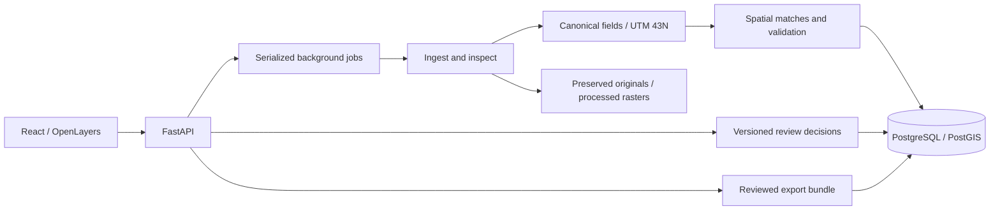

# Architecture

## Storage and responsibility

Datasets store source metadata, SHA-256, original path, inspection and canonical mapping. Features store untouched input geometry, normalized WGS84 display geometry, projected WKT, original nonpersonal attributes and canonical attributes. On PostGIS, `geom_utm` is a stored generated Geometry column (SRID 32643) with a GiST index. This prevents disagreement between WKT and indexed geometry. SQLite provides local functional parity for records only; it is not advertised as a spatial database.

Each review decision appends the prior issue/feature snapshot, resulting state, reviewer label, note and UTC timestamp. Original upload files and original geometry are never overwritten. The public API has no delete/overwrite endpoint for decision history or event history. The audit is application-append-only; a database administrator could still alter it. No cryptographic tamper-proof claim is made.

Review updates require the expected issue version and pending status. Conflicting/stale writes return HTTP 409. Edits supersede pending findings that refer to the changed feature. Analysis fingerprints include geometry and canonical attributes, so re-analysis produces new evidence for revised features without duplicating unchanged findings. Resolved observations remain part of the audit history.

Imports and analysis run in a serialized background thread. Job rows retain queued/running/complete/failed state, processing message and timestamps. Imports are committed per dataset; a failed reference-pack job can resume missing sources. The service must use one worker. Restart marks interrupted jobs failed. This is a lightweight bounded pilot queue, not a distributed task system.

## Spatial methods

- PyProj uses explicit source CRS and `always_xy=True`. Missing CRS for projected coordinates causes a validation error, not a geographic guess.
- Invalid geometry is retained and flagged; GEOS `make_valid` returns a proposal. It is not silently applied. Unsafe invalid geometry is excluded from intersection operations.
- Same-dataset polygons use an STRtree spatial index. Intersection area above 1 m² creates an overlap finding; touching boundaries alone do not.
- Road centreline crossing requires more than 2 m inside a polygon buffered inward by 0.5 m. Known bridges/tunnels/covered/nonzero-layer roads are excluded. Missing tags still permit false positives.
- Gaps are computed **only** from an explicitly declared `coverage` polygon and a `parcel` layer. Spaces between buildings are not reported as cadastral gaps.
- Candidate relationships are generated within 30 m for compatible feature roles. At most the three highest candidates per source feature scoring at least 25/100 are proposed. These are not global one-to-one assignments.
- Polygon similarity uses IoU 0.55, centroid proximity 0.20 and area ratio 0.15. Name evidence contributes 0.10 when supplied, exact parcel-reference evidence 0.25 when supplied. Available weights are normalized. Point evidence uses containment/coincidence 0.60 and geometry proximity 0.30; line evidence uses Hausdorff proximity 0.90. Nonspatial records rely on exact identifiers (0.90). See `matching.py` for exact formulas.
- Scores are transparent ranking heuristics, not probabilities or empirical accuracy estimates. Independent survey quality and ground truth are unavailable.

## Raster handling

Rasterio inspects GeoTIFF dimensions, bands, data type, CRS, nodata, bounds and resolution. It reprojects to EPSG:32643 with nearest-neighbour resampling and preserves the original. The map preview displays the first band normalized to its 2nd–98th percentiles. Imagery classification, image registration and automatic parcel extraction are not implemented or implied. Raster alignment follows existing georeferencing, not inferred control points.

## Browser and exports

OpenLayers renders genuine GeoJSON vector features and optional raster previews. It supports layer visibility, panning/zooming, evidence highlighting, original/current overlay, source selection and vertex modification. The basemap is optional and defaults off; existing data remain usable without network access.

Exports are ZIP bundles. GeoJSON/CSV use longitude/latitude EPSG:4326; CSV includes geometry WKT. GeoPackage uses EPSG:32643 and separate geometry-type layers. Nonspatial records accompanying a GeoPackage are included as JSON sidecar. Each bundle contains source attribution/checksums, all issue statuses, reviewer decisions and event history. Unreviewed feature data do not silently enter the reviewed data file.

## Safety boundary

Uploads are local and limited to 30 MB and 15,000 vector records. Shapefile ZIPs are restricted to known sidecars, 100 entries and 100 MB expanded content; traversal and links are rejected. KML uses a hardened XML parser. GeoTIFF band-pixels are bounded. CSV formula injection is escaped on export. No arbitrary remote ingestion URL, shell command or SQL is exposed. Cross-origin browser writes are rejected. See limitations for the additional isolation/authentication needed before production use.
